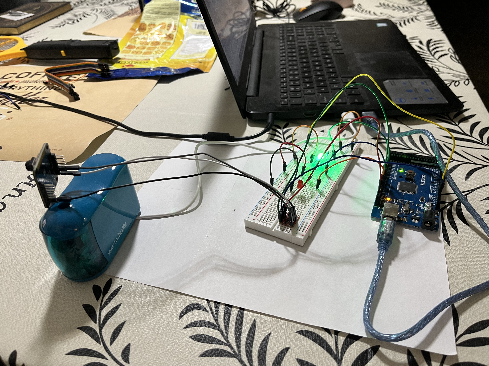
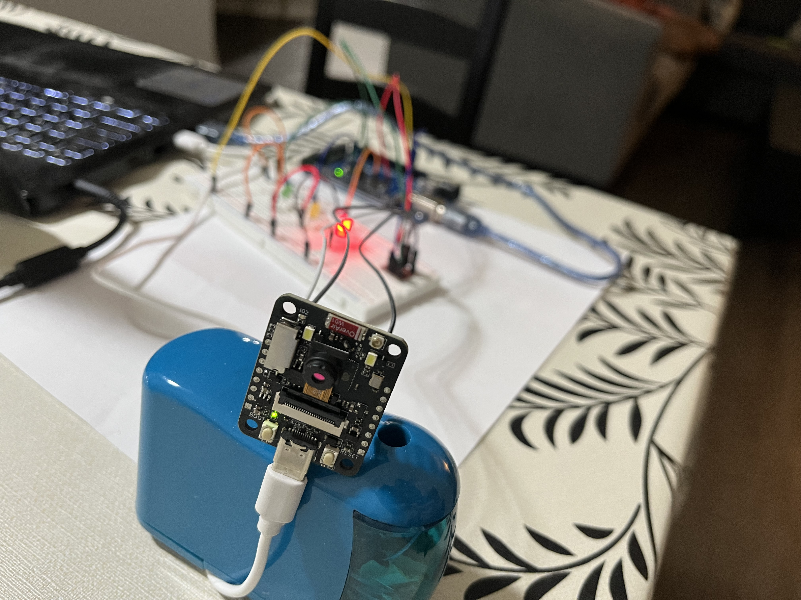
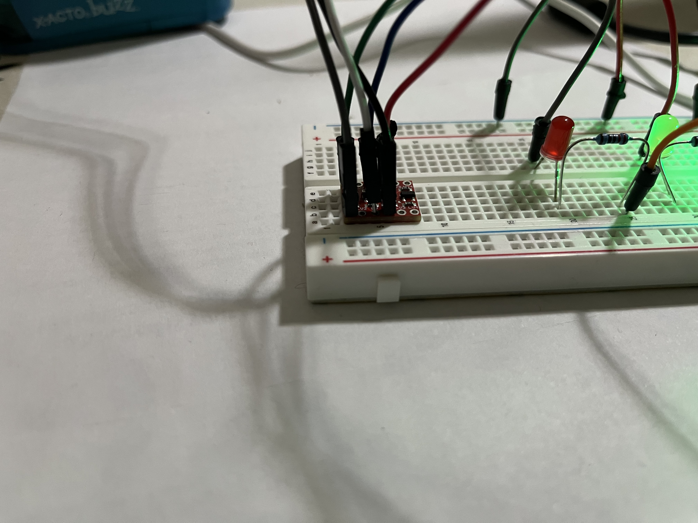
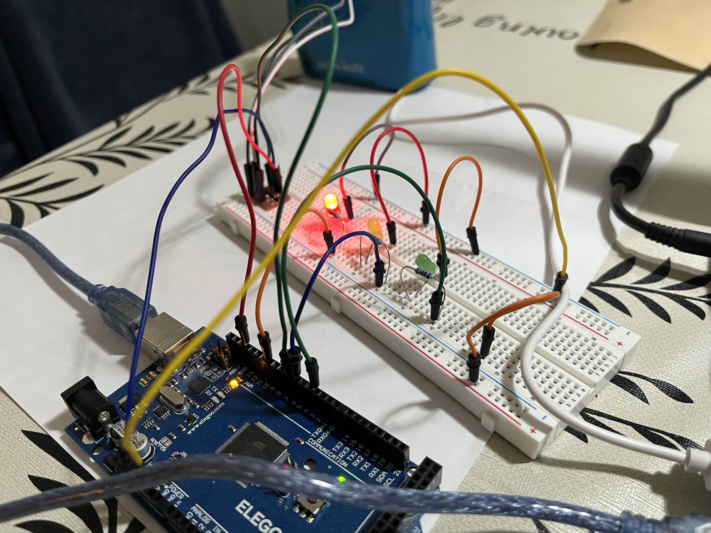

# AI-Based Squirrel Detection System

An AI-powered squirrel detection system built using an ESP32-S3 CAM, Edge Impulse, and an Arduino Mega 2560.

I built this project to detect squirrels using a camera and a machine-learning model trained with Edge Impulse. The ESP32-S3 captures an image and runs the AI model to determine whether a squirrel is present. When a squirrel is detected, the ESP32-S3 sends a signal to an Arduino Mega 2560, which turns on a red LED. When no squirrel is detected, the green LED turns on.

This project allowed me to work with machine learning, computer vision, embedded programming, electronics, and communication between two different microcontrollers.

---

## Project Goal

My goal was to build a working system that could take an image, use an AI model to detect a squirrel, and then show the result using physical LEDs.

The project combines:

- Computer vision
- Machine learning
- Embedded AI
- ESP32-S3 camera hardware
- Arduino Mega hardware
- 3.3V-to-5V logic-level communication

---

## How It Works

The system works in several steps:

1. The ESP32-S3 CAM captures an image.
2. The Edge Impulse machine-learning model analyzes the image.
3. The model classifies the image as either:
   - `squirrel`
   - `non squirrel`
4. If the squirrel confidence reaches the detection threshold of **0.50**, the ESP32 sets GPIO1 HIGH.
5. The signal passes through a BOB-12009 logic-level converter.
6. The Arduino Mega reads the signal on Digital Pin 7.
7. The Mega turns on the appropriate LED.

### System Architecture

```text
                 ┌─────────────────────┐
                 │    ESP32-S3 CAM     │
                 │                     │
                 │ Camera + AI Model   │
                 └──────────┬──────────┘
                            │
                         GPIO1
                            │
                            ▼
                 ┌─────────────────────┐
                 │  BOB-12009 Level    │
                 │  Converter          │
                 │  3.3V → 5V          │
                 └──────────┬──────────┘
                            │
                           D7
                            │
                            ▼
                 ┌─────────────────────┐
                 │    Arduino Mega     │
                 │                     │
                 │   LED Controller    │
                 └─────────┬───┬───────┘
                           │   │
                          🔴  🟢
```
## Machine Learning

I trained the squirrel detection model using Edge Impulse.

The dataset contains 140 images with two classes:

- `squirrel`
- `non squirrel`

The results reported by Edge Impulse were:

| Result | Accuracy |
|:---|---:|
| **Validation accuracy** | **65.2%** |
| **Test-set accuracy** | **81.5%** |

The 81.5% test-set accuracy is the result reported by Edge Impulse for the test dataset. It does not mean that the system will have the same accuracy in every real-world situation. Factors such as lighting, distance, background, and camera angle can affect detection.

---

### LED Status

| Mega Pin | LED | Function |
|:---|:---|:---|
| **D10** | **Red** | Squirrel detected |
| **D3** | **Green** | No squirrel detected |

The red LED turns on when a squirrel is detected. The green LED turns on when no squirrel is detected.

---

### Hardware

The main components I used are:

- ESP32-S3 CAM V1.2
- Arduino Mega 2560
- SparkFun BOB-12009 logic-level converter
- Red LED
- Green LED
- Resistors
- Jumper wires

The ESP32-S3 uses 3.3V logic and the Arduino Mega uses 5V logic, so I used the BOB-12009 to safely transfer the detection signal between the two boards.

---

### Testing

I tested the project one part at a time before putting the complete system together.

I first tested the LEDs on the Arduino Mega. I then tested Digital Pin 7 using HIGH and LOW signals to make sure the Mega could correctly respond to the ESP32 signal.

After that, I tested the ESP32 GPIO1 output and the camera. Once the individual parts were working, I connected the ESP32-S3, level shifter, and Arduino Mega together.

I also tested the Edge Impulse model on the ESP32-S3 to make sure that the AI prediction could control the physical LEDs.

---

### Challenges

I ran into several problems while building the project.

One challenge was connecting the ESP32-S3 and Arduino Mega because they use different logic voltage levels. I used the BOB-12009 level converter to handle the 3.3V-to-5V signal.

I also had a compilation problem with the Edge Impulse ESP-NN library while trying to build the ESP32-S3 firmware. I had to troubleshoot the library configuration before I could successfully compile the project.

Another problem happened when I tested the Mega input. When Digital Pin 7 was not connected to a defined signal, the input could randomly read HIGH or LOW. I learned that this was caused by a floating input.

I also experienced camera capture problems during development and had to troubleshoot the ESP32 power and USB setup.

Working through these problems helped me understand how the software, hardware, power, and communication parts of the project all depend on each other.

---

## 📸 Project Photos

### Complete System



### ESP32-S3 Camera



### Logic-Level Converter



### Squirrel Detection



---

---

## Project Structure

The repository is organized like this:

```text
AI-Squirrel-Detection-ESP32/
├── README.md
├── firmware/
│   ├── ESP32/
│   │   └── Squirrel_ESP32.ino
│   └── Arduino-Mega/
│       └── Squirrel_Mega.ino
├── hardware/
│   └── wiring-diagram.md
├── photos/
│   ├── system-overview.jpg
│   ├── esp32-camera.jpg
│   ├── level-shifter.jpg
│   └── squirrel-detection.jpg
├── docs/
│   └── project-report.md
└── LICENSE

```

## Project Links

### Edge Impulse

The Edge Impulse project contains my dataset, machine-learning model, training information, and evaluation results.

[View the Edge Impulse Project](https://studio.edgeimpulse.com/public/1121907/latest)

### GitHub

This repository contains my ESP32-S3 and Arduino Mega firmware, hardware documentation, project photos, and project report.

[View the GitHub Repository](https://github.com/dishadometi/AI-Squirrel-Detection-ESP32/tree/main)

## Future Improvements

There are several things I would like to improve if I continue working on this project.

- **Larger training dataset:** Add more squirrel and non-squirrel images with different backgrounds, lighting conditions, distances, and camera angles.

- **Real outdoor testing:** Test the system outside with real squirrels instead of mainly testing with images during development.

- **More animal classes:** Expand the model so it can recognize other animals instead of only squirrel versus non-squirrel.

- **Wireless notifications:** Add a way for the ESP32 to send a notification to a phone when a squirrel is detected.

- **Outdoor enclosure:** Build a weather-resistant enclosure so the system could be used outside for longer periods of time.

- **Improve detection reliability:** Experiment with different model settings and detection thresholds to reduce incorrect detections.
